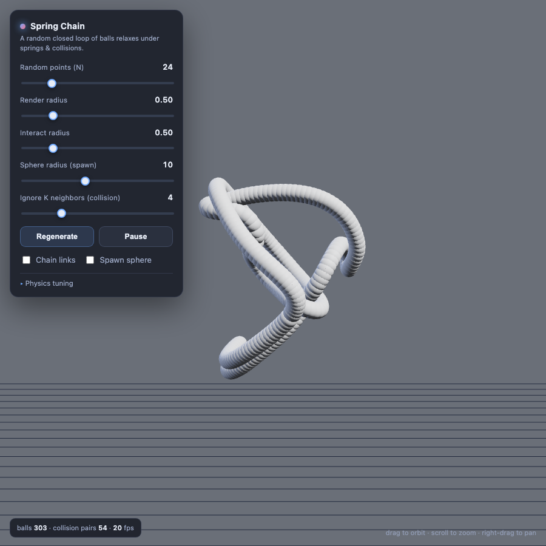

# Spring Chain

A web app that renders a chain of balls connected by springs and lets it relax
into a self-organizing, self-avoiding clump.



## What it does

1. **Skeleton** — picks `N` random points uniformly inside a sphere and connects
   them into a **cycle** in the order they were picked (a closed loop).
2. **Balls** — walks that closed polyline and places balls along it, spaced one
   **render radius** apart by arc length.
3. **Relaxation** — runs a little physics simulation every frame:
   - **Springs** connect each ball to the next one around the loop, with a
     **target length of 0**, so the whole loop pulls itself together.
   - **Collisions** push apart any two balls whose centers come closer than
     `2·interact radius` — but the **K nearest neighbors along the chain (either
     direction) are ignored** (K is adjustable, default 4), so the rope can fold
     tightly on itself while still avoiding distant strands. Larger K → tighter
     pull-together.
   - **Adaptive level-of-detail** keeps the bead spacing even as the rope
     deforms: a chain edge shorter than `mergeRatio · render radius` drops a ball,
     and one longer than `splitRatio · render radius` gets a ball inserted at its
     midpoint. So the ball count rises and falls automatically while the rope
     finds its equilibrium length.
   - The **centroid is pinned at the origin** after every step.

The result: the loop collapses out of its sphere-filling tangle into a compact,
evenly-beaded, self-avoiding rope that settles at the length where the spring
pull and the collision push balance.

There are two independent radii. **Render radius** sets the drawn ball size and
the target bead spacing (and the LOD band). **Interact radius** sets the
collision distance (`2·interact`). They start equal; pull them apart to e.g.
draw fat beads that collide like thin ones (denser tangle) or vice versa.

## Run it

It's a single self-contained file — no build step. Three.js is loaded from a CDN,
so you just need a static server (and an internet connection on first load):

```sh
cd multiversegame
python3 -m http.server 8000
# then open http://localhost:8000/
```

Any static server works (`npx serve`, etc.). A real GPU / WebGL is recommended —
software renderers will look dim.

## Controls

| Control | Effect |
| --- | --- |
| **Random points (N)** | Number of random seed points in the loop (regenerates). |
| **Render radius** | Drawn ball size and target bead spacing. Changing it does **not** regenerate — the LOD pass re-targets the spacing live. |
| **Interact radius** | Collision distance (`2·interact`), independent of the drawn size. |
| **Sphere radius (spawn)** | Radius of the sphere the random points are drawn from. |
| **Ignore K neighbors** | How many chain-neighbors (each direction) are exempt from collision. Higher = the loop pulls together more tightly. Default 4. |
| **Regenerate** | Draw a fresh set of random points. |
| **Pause / Resume** | Freeze or resume the simulation. |
| **Chain links** | Draw the loop connectivity as a line. |
| **Spawn sphere** | Show the wireframe spawn sphere for reference. |
| **Physics tuning** | LOD merge/split ratios (× render radius), spring pull, collision push, damping, jiggle, and substeps/frame. |

Drag to orbit, scroll to zoom, right-drag to pan.

## Implementation notes

- **Rendering** uses a single `THREE.InstancedMesh`, so thousands of balls draw
  in one call. Lit by directional key/fill/rim lights with ACES tone mapping
  against a grey backdrop, so the white balls read as white with real shading.
- **Collision broad-phase** uses a spatial hash grid (cell size = `2·interact`),
  so only nearby pairs are tested rather than all O(n²) pairs.
- **Adaptive LOD** rebuilds the cyclic ball sequence each frame into preallocated
  scratch buffers (no per-frame allocation). A count floor of `2·K + 3` keeps
  some non-neighbor pairs alive so collisions never fully switch off — otherwise
  over-merging would let the springs implode the loop to a point.
- **Integration** is damped semi-implicit Euler with a fixed `dt` and several
  substeps per frame for stability.
- A `window.__dbg` handle (centroid, spread, instance colors) is exposed for
  automated testing; it has no effect on behavior.

Everything lives in [`index.html`](index.html).

## License

[MIT](LICENSE)
